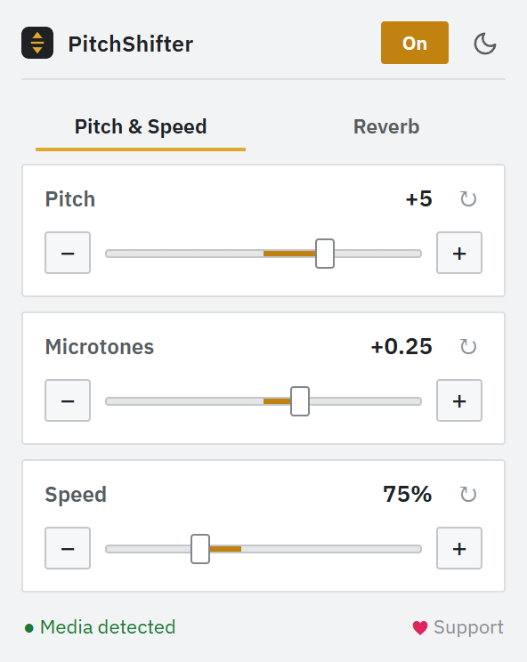
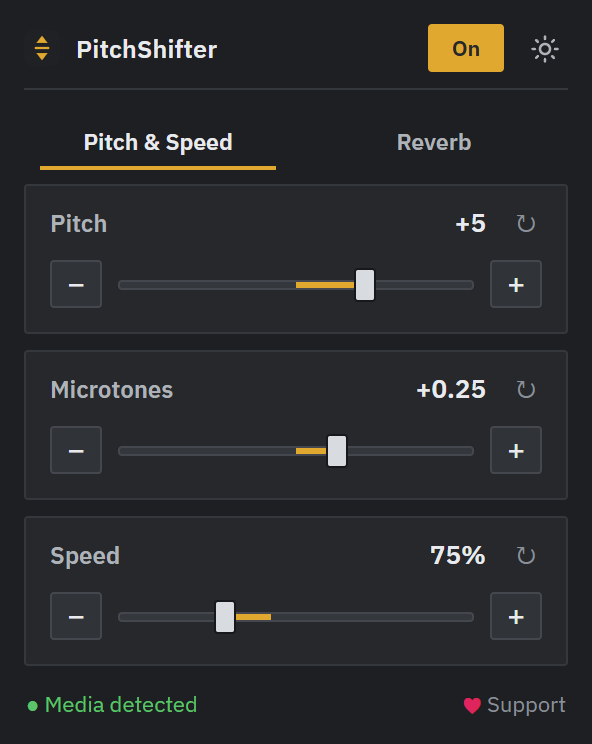
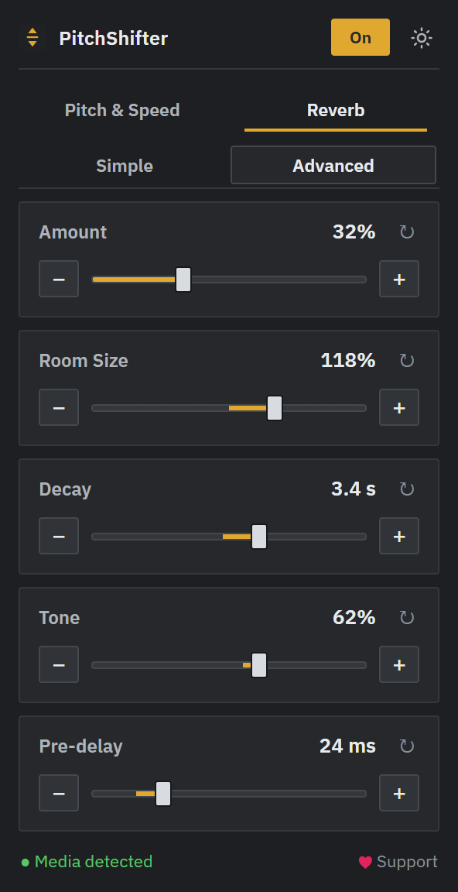

# PitchShifter

Transpose browser media, change its speed independently and add adjustable reverb — all isolated to the current tab. For Firefox.

  
  
  

🦊 https://addons.mozilla.org/en-US/firefox/addon/pitchshifter/ 🦊

## What's new in 1.1.0

- Per-tab On/Off control prevents PitchShifter from overriding media settings in other tabs, while guarding the selected speed when players reconfigure background media.
- AudioWorklet-based pitch and speed processing removes the previous visible delay and page-load crackling.
- Adaptive WSOLA/phase-vocoder speed processing keeps the configured pitch intact and reduces repeated-segment artifacts during slowdowns.
- A dedicated Reverb tab adds Simple and Advanced controls for amount, room size, decay, tone and pre-delay.

## Features

- Real-time pitch shifting that keeps tempo, plus independent speed control whose pitch is compensated by the same SoundTouch engine.
- Separate Reverb tab with Simple and Advanced modes, stereo early reflections, a dense diffused tail and a smooth constant-power dry/wet mix.
- Hybrid SoundTouchJS engine: WSOLA in the normal range and a phase vocoder for smoother extreme slowdowns, with Lanczos interpolation in both.
- AudioWorklet processing keeps the DSP off the page thread, preventing page/DOM work from starving its audio callback.
- Works on supported HTML5 media, including pages with strict CSP (YouTube, etc.) and detached media elements used by players such as Spotify Web.
- Zero added latency when both pitch and speed are neutral: the audio goes straight through, as if the effect were off.
- Control values are remembered as presets, while activation is isolated to the current tab.
- Clean control-panel UI that follows your light/dark browser theme.

## Controls

Click the toolbar icon to open the popup.

| Control | Range | Step |
| --- | --- | --- |
| Pitch | -12 to +12 | 1 semitone |
| Microtones | -1.00 to +1.00 | 0.01 |
| Speed | 25% to 200% | 1% |
| Reverb | 0% to 100% | 1% |
| Room Size (Advanced) | 50% to 150% | 1% |
| Decay (Advanced) | 0.8 s to 5.0 s | 0.1 s |
| Tone (Advanced) | 0% dark to 100% bright | 1% |
| Pre-delay (Advanced) | 0 ms to 100 ms | 1 ms |

Pitch, Microtones and Speed live on the front tab; Reverb has its own tab. **Simple** exposes only Amount and uses the tuned studio-room defaults. **Advanced** also exposes Room Size, Decay, Tone and Pre-delay while retaining the same Amount control. Pitch shift is `(pitch + microtones) / 12` octaves and does not change tempo. Speed changes tempo while SoundTouch compensates the pitch. Each numeric control has a slider, -/+ buttons, direct entry and reset. Use the **On/Off** button to control only the current tab; moving any control turns it on for that tab. Turning it off restores the page's previous playback speed and pitch-preservation setting. Saved values remain available as presets, but a new or reloaded tab starts off so other sites keep their native media settings.

## Install

1. Open `about:debugging#/runtime/this-firefox`.
2. Click "Load Temporary Add-on".
3. Select `manifest.json` in this folder.

Temporary add-ons are removed on browser restart. To keep it installed, package and sign with [web-ext](https://extensionworkshop.com/documentation/develop/getting-started-with-web-ext/) via [addons.mozilla.org](https://addons.mozilla.org/).

## How it works

- `injected.js` runs directly in the page's main world via Manifest V3; `content.js` relays messages between the popup and the page.
- `injected.js` captures each media element with the Web Audio API and coordinates its routing. The official SoundTouchJS 2.1.1 worklets run WSOLA and phase-vocoder processing on the browser's audio render thread.
- Both worklets are packaged as web-accessible extension resources. Their extension URLs are supplied by `content.js`, so they load without depending on the host page's scripts.
- When no compensation is required, the element is wired straight to the output and the shifter is taken out of the path entirely — no buffering and no added latency.
- Speed is applied as the element's `playbackRate` with native pitch preservation disabled. Pitch and playback rate are mirrored to separate worklet `AudioParam`s; SoundTouch divides the requested pitch by playback rate internally, so Speed does not alter the configured pitch.
- Rapid slider input is coalesced to one update per visual frame. Pitch changes use a short 40 ms parameter ramp; playback-rate compensation is applied immediately so Speed cannot leak into audible pitch.
- WSOLA uses a low-latency profile at normal speeds and tempo-aware windows with a longer overlap below 70% Speed; it returns to low latency above 76% to prevent profile oscillation. Below 45% the phase vocoder is selected automatically, and WSOLA returns only above 55%. A warmed-up 50 ms crossfade hides every processor/profile switch.
- Reverb runs after the pitch engine, so an engine crossfade does not restart its tail. The generated stereo impulse combines asymmetric early reflections, a 12-line feedback delay network and frequency-dependent late decay. Advanced Room Size and Decay changes create a cached impulse and crossfade between convolvers over 120 ms; Tone and Pre-delay use smoothly automated realtime nodes. Reverb DSP is created lazily and removed from the input path at 0%.
- The popup reads and writes state through the content script. Values are saved to `storage.local` as presets, but the enabled state remains local to the current tab and is never applied automatically elsewhere.

## Limitations

- Cross-origin media without CORS headers can't be read by the Web Audio API, so pitch can't be shifted on it (speed still works).
- Each processing engine needs a short amount of audio before producing output. The phase vocoder makes very slow playback smoother, but difficult material can still exhibit some frequency smearing. With pitch at 0 and speed at 100%, there is no added latency.

## Credits

- Pitch engines: [SoundTouchJS AudioWorklet and Phase Vocoder Worklet 2.1.1](https://github.com/cutterbl/SoundTouchJS) by Steve “Cutter” Blades, based on the original work by Olli Parviainen et al. The bundled processors are available under MPL-2.0; see `soundtouch-worklet.LICENSE.txt`.
- UI typeface: [IBM Plex Sans](https://github.com/IBM/plex), SIL Open Font License 1.1 (see `popup/fonts/OFL.txt`). Bundled as a latin subset.

## License

Copyright (c) 2026 daffwt221. All rights reserved (see [LICENSE](LICENSE)). Bundled components keep their own licenses: SoundTouchJS AudioWorklet (MPL-2.0) and IBM Plex Sans (SIL OFL-1.1) — see Credits.

## Files

| File | Role |
| --- | --- |
| `manifest.json` | Manifest V3; `storage`; popup plus isolated/page-world content scripts on all frames. |
| `popup/` | Popup UI (`popup.html`, `popup.css`, `popup.js`) and bundled font in `popup/fonts/`. |
| `content.js` | Bridge between popup and page; keeps activation isolated to the current tab. |
| `injected.js` | Page-world media capture, state, and Web Audio routing. |
| `soundtouch-worklet.js` | Bundled SoundTouchJS 2.1.1 WSOLA processor running on the audio render thread. |
| `phase-vocoder-worklet.js` | Bundled SoundTouchJS 2.1.1 phase-vocoder processor for extreme slow speeds. |
| `soundtouch-worklet.LICENSE.txt` | MPL-2.0 notice and upstream source for the bundled processors. |
| `icons/icon.svg` | Toolbar icon / logo. |
